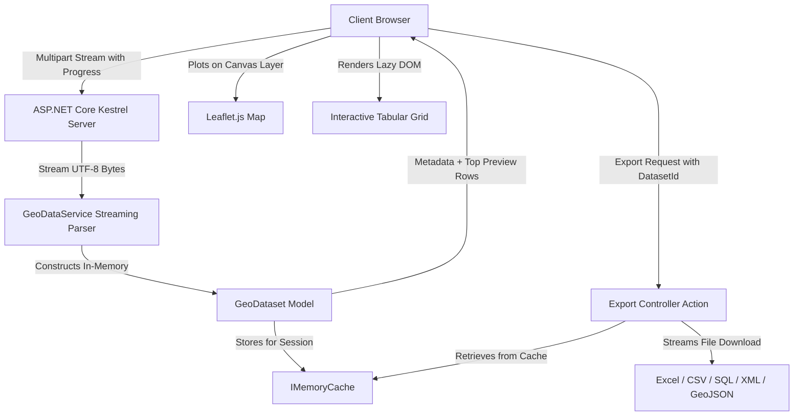

# 🌐 GeoFormat Hub

> **High-Performance Geospatial & JSON Conversion, Live Leaflet Visualizer & Multi-Format Data Engine**  
> Built with **ASP.NET Core 8.0 MVC**, **Leaflet.js**, **ClosedXML**, and modern zero-allocation streaming architectures.

---

## 🚀 Overview

**GeoFormat Hub** is a web-based geospatial inspection, visualization, and conversion platform. It allows users to upload **arbitrarily large JSON and GeoJSON files** (e.g. 50MB, 200MB, 500MB, 1GB+) without hitting size limits, browser memory crashes, or server timeouts. 

Once uploaded, datasets are stream-parsed in memory, plotted on an interactive **Leaflet.js GIS map**, displayed in a fast **windowed tabular grid**, and can be instantly converted and exported into multiple standard enterprise data formats.

---

## ✨ Key Features

- ⚡ **Unlimited File Uploads (Streaming Engine)**:
  - Stream-based low-allocation parsing using `System.Text.Json` (`JsonDocument.ParseAsync(Stream)`).
  - Configured for unlimited multipart request bodies (`long.MaxValue`) in Kestrel and ASP.NET Core.
  - Real-time animated AJAX upload progress bar showing progress percentage, uploaded MB / total MB, and live transfer speed.
- 🗺️ **Interactive GIS Map Visualization**:
  - Canvas-accelerated **Leaflet.js** map supporting Points, LineStrings, Polygons, and Multi-geometries.
  - Interactive property inspection tooltips and zoom-to-fit bounds.
  - Automatic hardware-friendly sampling for massive datasets to maintain smooth 60 FPS interactions.
- 📊 **Windowed Interactive Data Grid**:
  - Instant client-side search filtering across all attributes.
  - Chunked lazy rendering (50-row batch DOM hydration) that prevents browser lockups even on 100,000+ records.
- 🔄 **Multi-Format Export Engine**:
  - **Excel (`.xlsx`)**: Styled spreadsheets with header formatting and column auto-sizing via ClosedXML.
  - **CSV (`.csv`)**: UTF-8 BOM compliant CSV generation via CsvHelper.
  - **SQL (`.sql`)**: Full `CREATE TABLE` and batch `INSERT INTO` script with automatic schema & data type inference.
  - **XML (`.xml`)**: Clean, well-formed XML dataset export.
  - **GeoJSON (`.geojson`)**: Valid GeoJSON `FeatureCollection` export.
  - **JSON (`.json`)**: Indented standard JSON export.
- 🧠 **100% In-Memory Architecture**:
  - Zero database requirements.
  - Intelligent memory caching (`IMemoryCache`) for instant format exports without re-uploading or re-parsing.

---

## 🏗️ Architecture & Data Flow



---

## 📂 Supported Input & Output Formats

| Format | Input Supported | Output Export Supported | Description |
| :--- | :---: | :---: | :--- |
| **GeoJSON (`.geojson`)** | ✅ Yes | ✅ Yes | FeatureCollections, Features, Geometry objects with CRS coordinates |
| **Standard JSON (`.json`)** | ✅ Yes | ✅ Yes | Array of JSON objects or nested key-value objects |
| **Excel (`.xlsx`)** | ❌ (Input via JSON) | ✅ Yes | Styled OpenXML spreadsheet with auto-width columns & headers |
| **CSV (`.csv`)** | ❌ (Input via JSON) | ✅ Yes | Standard comma-separated values with UTF-8 BOM |
| **SQL Script (`.sql`)** | ❌ (Input via JSON) | ✅ Yes | DDL `CREATE TABLE` + batch `INSERT INTO` statements |
| **XML (`.xml`)** | ❌ (Input via JSON) | ✅ Yes | Structured hierarchical XML tags per record |

---

## 🛠️ Tech Stack

- **Backend**: C# 12, .NET 8.0 ASP.NET Core MVC
- **Parsing**: `System.Text.Json` (Stream Parsing & Low-Allocation DOM)
- **Export Libraries**: ClosedXML (Excel), CsvHelper (CSV)
- **Frontend**: Vanilla JavaScript (ES6+), Bootstrap 5, Bootstrap Icons, Leaflet.js
- **CI/CD**: GitHub Actions (`.github/workflows/dotnet.yml`)

---

## 🚦 Getting Started

### Prerequisites

- [.NET 8.0 SDK](https://dotnet.microsoft.com/download/dotnet/8.0) or later.
- Modern Web Browser (Chrome, Edge, Firefox, Safari).

### Running Locally

1. **Clone the repository**:
   ```bash
   git clone https://github.com/your-username/geoformat-hub.git
   cd "GeoFormat Hub"
   ```

2. **Restore dependencies**:
   ```bash
   dotnet restore
   ```

3. **Build the solution**:
   ```bash
   dotnet build
   ```

4. **Launch the development server**:
   ```bash
   dotnet run
   ```

5. **Open in your browser**:
   Navigate to `https://localhost:7143` or `http://localhost:5247` (check terminal output for the active port).

---

## ⚙️ CI/CD Workflow (GitHub Actions)

This project contains a continuous integration workflow configured at [`.github/workflows/dotnet.yml`](.github/workflows/dotnet.yml).

The workflow automatically:
1. Triggers on every `push` and `pull_request` to `main`, `master`, and `develop`.
2. Sets up the .NET 8 SDK environment on `ubuntu-latest`.
3. Restores and builds the solution in `Release` configuration.
4. Executes unit/integration tests.
5. Publishes the ready-to-deploy web application bundle as a downloadable GitHub build artifact.

---

## 📁 Project Structure

```
GeoFormat Hub/
├── .github/
│   └── workflows/
│       └── dotnet.yml         # GitHub Actions CI/CD Pipeline
├── Controllers/
│   └── HomeController.cs      # Upload, Stream Processing & Multi-Format Export Actions
├── Models/
│   ├── FileUploadViewModel.cs # ViewModel for upload feedback & form bindings
│   ├── GeoDataset.cs          # In-memory structured dataset & export models
│   └── ErrorViewModel.cs      # Error diagnostics
├── Services/
│   ├── IGeoDataService.cs     # Conversion & parsing service interface
│   └── GeoDataService.cs      # Core stream-based parsing & format generators
├── Views/
│   ├── Home/
│   │   └── Index.cshtml       # Main UI (Dropzone, Progress Bar, Map, Data Grid)
│   └── Shared/
│       └── _Layout.cshtml     # Responsive layout, Bootstrap 5 & Leaflet.js includes
├── wwwroot/
│   ├── css/                   # Custom styling & animations
│   ├── js/
│   │   └── geo-viewer.js      # AJAX streaming upload, Leaflet map & lazy table controller
│   └── sample_data.geojson    # Built-in sample spatial dataset
├── Program.cs                 # App setup, Kestrel unlimited limits & DI registration
├── README.md                  # Project documentation & guide
└── GeoFormat Hub.csproj       # Project configuration & package references
```

---

## 📄 License

This project is licensed under the [MIT License](LICENSE).
